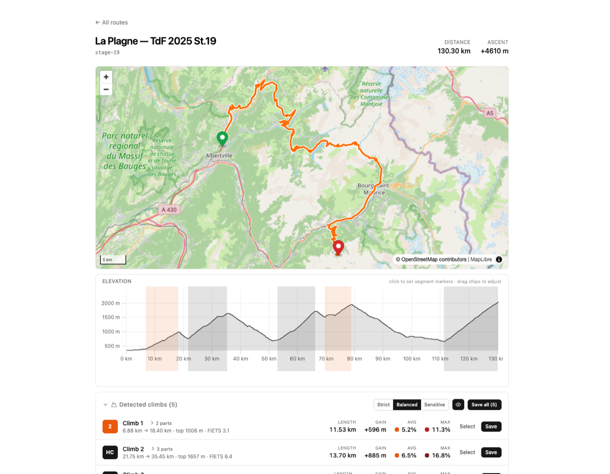
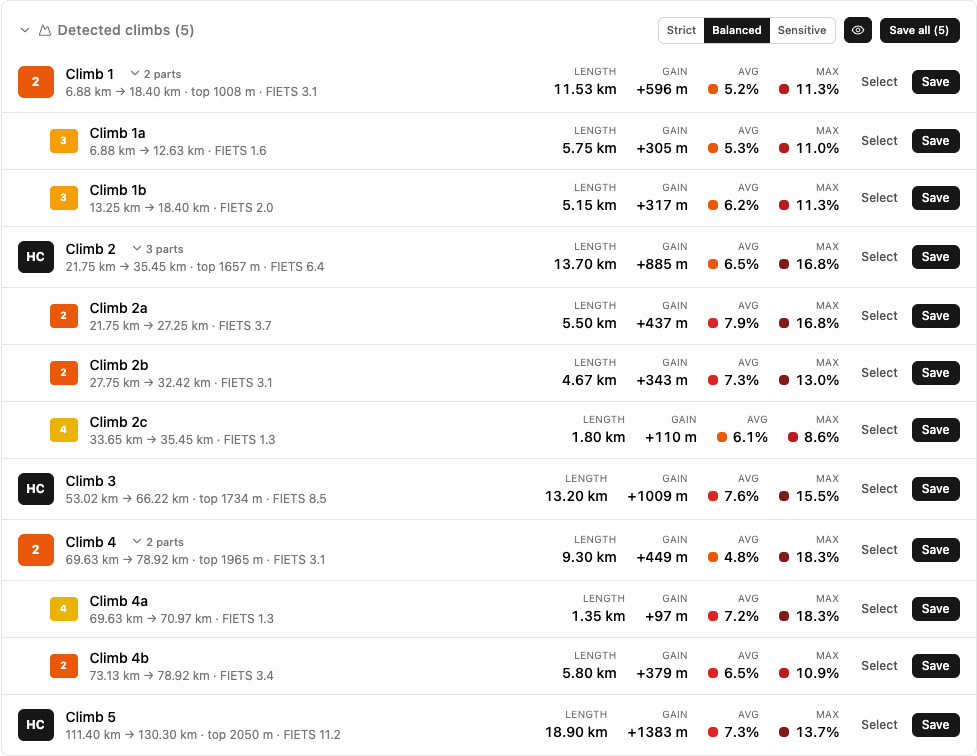
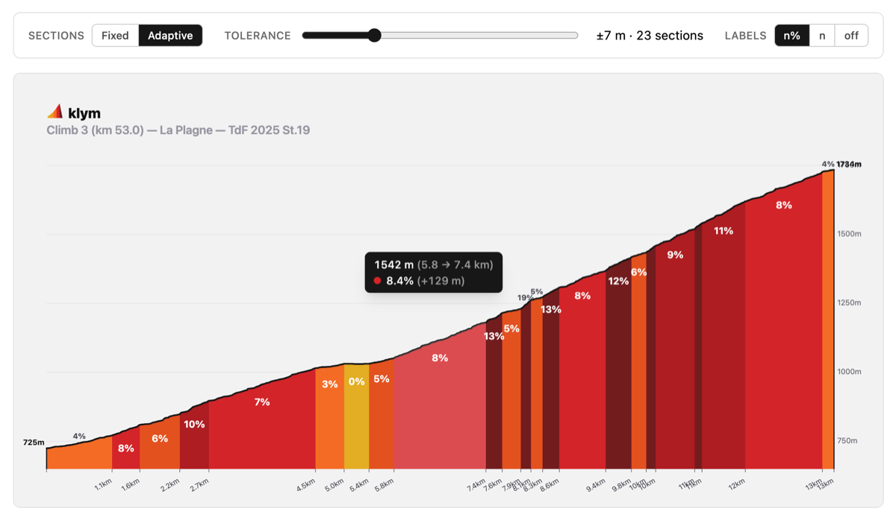
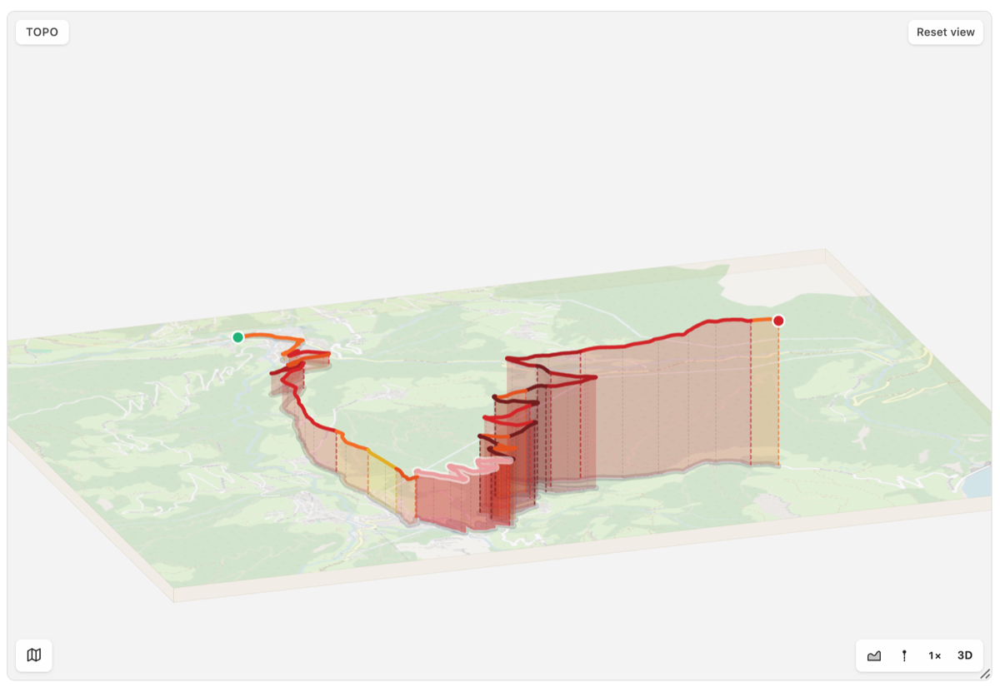

<p align="center">
  
</p>

<h1 align="center">klym</h1>

<p align="center">
  Turn a GPX file into climbfinder.com-style colored-bar climb profiles.
</p>

<p align="center">
  
</p>

## What it does

1. **Upload a GPX.** Name it; klym slugifies that into a route id.
2. **Browse it** on a map + elevation chart with a synced crosshair.
3. **Let klym find the climbs.** It autodetects candidates and lists them with
   length, gain, grade, category and FIETS index — hover to preview, _Select_
   to load one into the markers, or _Save_ it straight away. A climb split by a
   real descent shows up as one climb with expandable parts (A, B, A+B); short
   false flats stay seamless.

   <details>
   <summary>Screenshot — detected climbs</summary>

   

   </details>

4. **Or crop by hand.** Place two markers (A, B) — click to set, drag to
   fine-tune. Placement is directional (clicks left of A set A, right of B set
   B) and A can't cross past B.
5. **Render the profile.** Save a crop to get the CF-style image: 500m-bucket
   bars colored by gradient, elevation line on top, labeled endpoints. Tune the
   bin size live, toggle grade labels, then export as PNG, copy to clipboard, or
   download the raw SVG.

   <details>
   <summary>Screenshot — climb profile</summary>

   

   </details>

6. **Spin the terrain.** Each segment also gets a 3D topo view — the route
   draped over OSM ground you can tilt and rotate.

   <details>
   <summary>Screenshot — 3D topo</summary>

   

   </details>

## Stack

- SvelteKit 2 + Svelte 5 + TypeScript + Vite 8
- Tailwind CSS v4 (`@tailwindcss/vite`)
- MapLibre GL (OSM raster tiles) for the map
- uPlot for the interactive elevation chart
- `fast-xml-parser` for GPX parsing
- In-memory, per-session storage — no database, no disk
- `@sveltejs/adapter-node` for self-hosting · Vitest for the test suite

## Getting started

```sh
pnpm install
pnpm dev
```

Then open http://localhost:1047.

## Commands

| Command        | What it does                       |
| -------------- | ---------------------------------- |
| `pnpm dev`     | Dev server with HMR (port 1047)    |
| `pnpm build`   | Production build                   |
| `pnpm preview` | Preview the production build       |
| `pnpm check`   | `svelte-kit sync` + `svelte-check` |
| `pnpm test`    | Run the Vitest suite               |

## Storage

Everything is **in-memory and per-visitor** — nothing touches disk. Each
visitor gets an isolated sandbox keyed by an anonymous session cookie; data is
dropped when the session expires (~6h idle) or the process restarts. That's
intentional for the hosted, login-less app.

## Self-hosting

`pnpm build` emits a standalone Node server (`node build/index.js`). klym runs
live at [klym.hlink.dev](https://klym.hlink.dev) via a Nix flake + NixOS
module — see [HOSTING.md](./HOSTING.md).

## License

MIT. See [LICENSE](./LICENSE).
